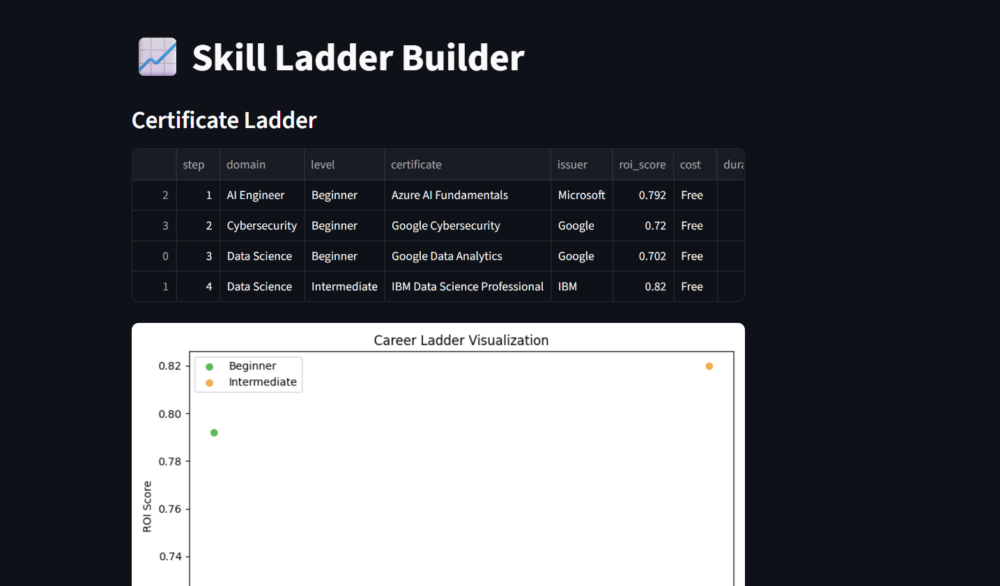

# 📈 Skill Ladder Builder

An interactive Streamlit app to design career‑oriented certification pathways.  
It loads datasets of industry‑recognized certificates, calculates ROI scores, sequences them into ladders (Beginner → Intermediate → Advanced), and visualizes progression.

---

## ✨ Features
- **Data Loader (`fetch.py`)** – imports certificate datasets.
- **Scoring Engine (`score.py`)** – assigns ROI scores based on issuer credibility, cost, duration, and level.
- **Ladder Sequencer (`map.py`)** – orders certificates into a structured career path.
- **Visualization (`export.py`)** – generates scatter plots of ROI vs. step.
- **Streamlit UI (`streamlit_app.py`)** – interactive web interface with tables and charts.

---

## 🚀 Getting Started

### Prerequisites
- Python 3.11+
- pip

### Installation
```bash
git clone https://github.com/avikumar-sys/skill-ladder-builder.git
cd skill-ladder-builder
pip install -r requirements.txt
```

## 📊 Demo Screenshots

Here’s the Skill Ladder Builder in action:



ROI chart view:


Certificate table view:

